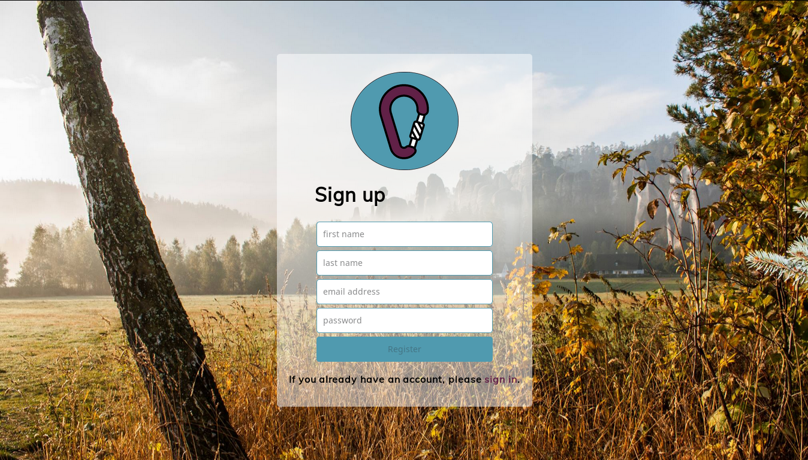
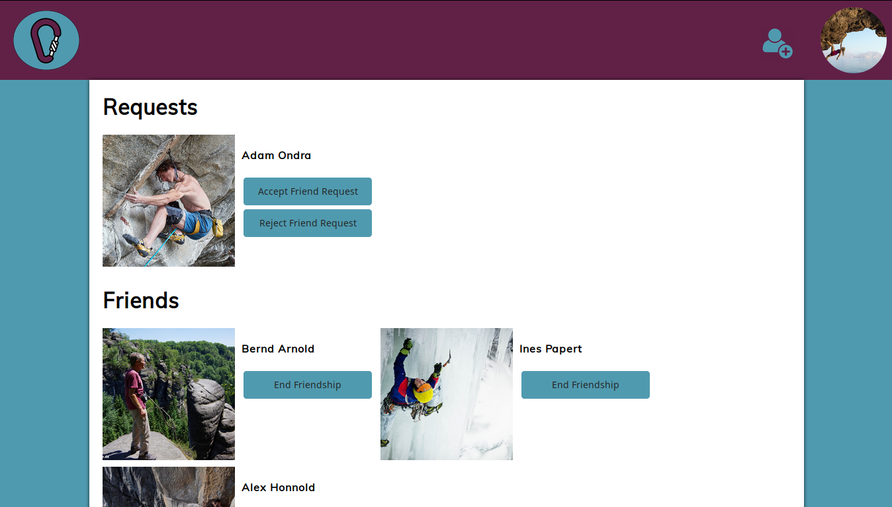
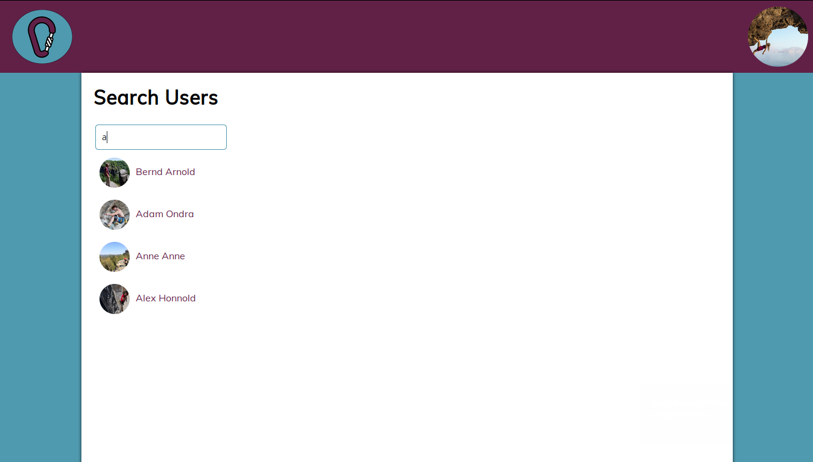

# Social Network

React single-page application where users can sign up, say a little about themselves, chat and become friends with other users.

## Features
* Log into an existing account or register a new one.
* Add description to profile and upload profile picture (stored in Amazon S3).
* Search for other users by name, look at their profile, add them as friends.
* View friends and friend requests. Real-time alert on new friend request coming in.
* View other currently logged-in users.
* Chat in a global real-time chat room.

## Technologies
HTML, CSS, JavaScript, React, Redux, Socket.io, Node.js, Express, PostgreSQL

## Development
* Edit PostgreSQL database parameters in [db.js](config/db.js).
* Run files in [sql](sql) to initialize tables in database.
* Configure Amazon S3 parameters in [s3.js](config/s3.js) and [config.json](config/config.json).
* Set `process.env.COOKIE_SECRET` or edit cookie secret parameter directly in [index.js](index.js).

``` sh
npm install
node bundle-server.js
node index.js
```

## Preview

### login


### view friends list


### search users
